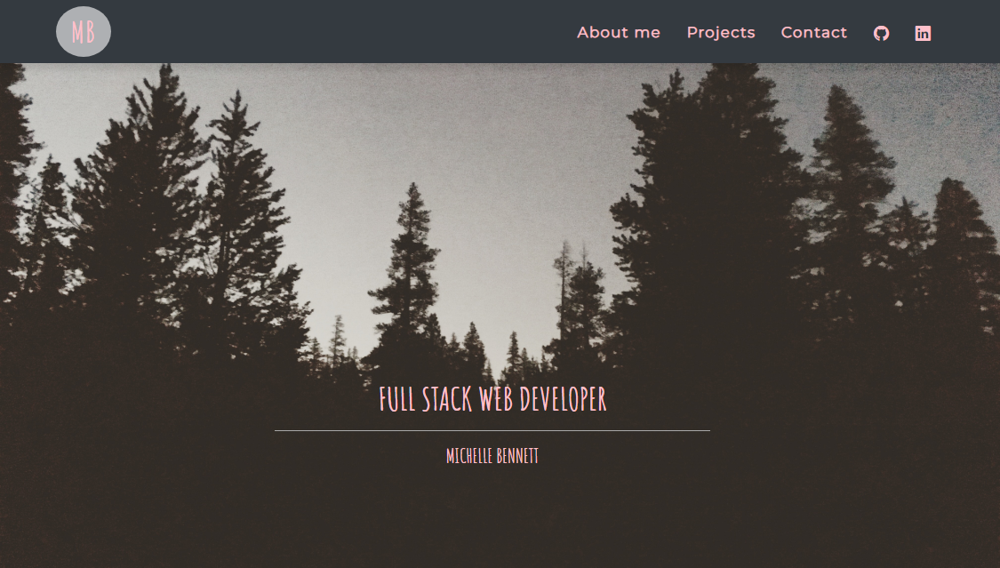
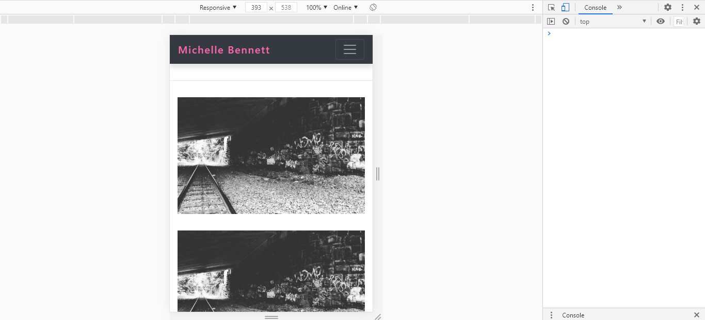

# Portfolio
### Description

Here is an updated version of my Portfolio to showcase my newly acquired mad skills.  

---

### Table of Contents
* [Installation](#Installation) 
* [Usage](#Usage)  
* [Credits](#Credits)  
* [Badges](#Badges)  
* [License](#License)

---

### Installation 
<a href = "https://mbennett1991.github.io/Portfolio/">Click me</a> to see my portfolio!

---

### Usage  
Here is my portfolio in action!

 
 

---

### Links
Below is a link to my gitHub pages to see more of our work!

<a href = "https://github.com/mbennett1991/">Michelle Bennett</a>
 
---
  
### Credits
@Chiggy

---

### Badges 
 
 

---

### Licenses 
© 2021 Michelle Bennett 
© 2021 Trilogy Education Services, a 2U, Inc. brand. All Rights Reserved.